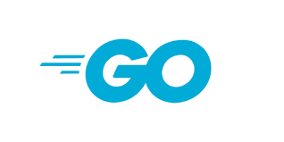

<h1 align="center">
  
</h1>

<h1 align="center">Alura Store</h1>
<p align = "center"> An API to manage products in Store</p>


<p align="center">
  <a href="#-technology">Technology</a>&nbsp;&nbsp;&nbsp;|&nbsp;&nbsp;&nbsp;
    <a href="#-project">Project</a>&nbsp;&nbsp;&nbsp;|&nbsp;&nbsp;&nbsp;
  <a href="#-how-to-run">How to Run</a>&nbsp;&nbsp;&nbsp;|&nbsp;&nbsp;&nbsp;
  <a href="#-license">License</a>
</p>

<p align="center">
  
</p>

## ✨ Technology

The Project was develop as using the following techs:
- [Go](https://go.dev/)
- [Postgres](https://www.postgresql.org/)
- [pq](https://github.com/lib/pq)
- [Javascript](https://www.javascript.com/)


## 💻 Project
Repository developing during the course *Go: crie de uma aplicação web*. The points covered by the course is

- Create a web application from scratch with Go, following the main of conventions
- Using Struct 
- Connect the application in a database
- Using Partials

We also use the pattern Model-View-Controller(MVC), therefore it is possible to test routes in our application without any API platform to test it. 

###  📓 Requirements 
As educational project, and the purpose is use the concepts of CRUD, then we requirements of the our applications is to : 
1. List all the products in store
2. Create a product
3. Delete Product
4. Update a product

As can be seen above the list of requirements is , in summary, a simple CRUD.

### Products Attributes

| Product     | Type   |
| ----------- | ------ |
| Id          | int    |
| Name        | string |
| Description | string |
| Price       | float  |
| Quantity    | int    |


### End Points
The API has the following end points:

| Type         | url       | Functionality    |
| ------------ | --------- | ---------------- |
| ```get```    | "/"       | List Products    |
| ```post```   | "/insert" | Create a Product |
| ```delete``` | "/delete" | Delete a product |
| ```post```   | "/update" | Update a Product |


## 🚀 How to Run

To run the this project 

- Clone the repo and access the directory;
- You also need to have a Postgres and create a database and table;
  - The initial configurations can be encounter in `db.go`, it is needed to configure this instance;
- Init the instance in [`localhost: 8000`](http://localhost:8000) with `go run main.go`;


## 📄 License
The projects is under the MIT license. See the file [LICENSE](LICENSE) fore more details

---
## Author

Made with ♥ by Rafael 👋🏻


[](https://www.linkedin.com/in/rafael-mgr/)
[](mailto:ribeirorafaelmatehus@gmail.com)
